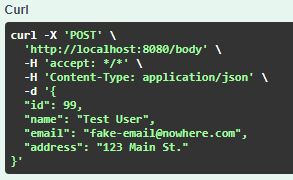
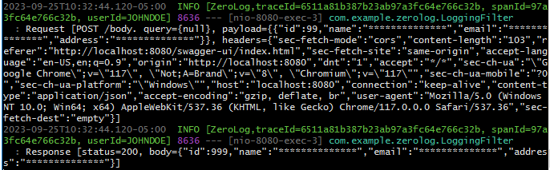

# Simple Request and Response Logger for APIs

This example demonstrates how Request and Reponses for all API calls can be logged using Spring Boot.  It also masks sensitive data based on your requirements.  It is written using Java and Spring Boot.

*NOTE: Please do NOT log PII or Sensitive Data!*

## What does it build?
* Uses Message Diagnostic Context (MDC) to add UserId to all logs.  
* Uses Micrometer to Tracing data for each log
* Creates a LoggingFilter that will intercept all calls and get relevant data
* Uses OpenAPI UI (Swagger) to visualize and test the API endpoints

## Example of the log
  * 
  * 

## Next Steps
* Secure all API access using robust Authentication (OIDC)
* Consider log data storage capacity increase, data retention and archival options
* In some cases, responses can be empty. For example, a /create endpoint may add a User but only return pass/fail (HTTP 200 OK,  HTTP 201 CREATED, etc.) information.  Understand what you need to log in those cases.

## Reference Documentation
For further reference, please consider the following sections:

* [Official Apache Maven documentation](https://maven.apache.org/guides/index.html)
* [Spring Boot Maven Plugin Reference Guide](https://docs.spring.io/spring-boot/docs/3.1.3/maven-plugin/reference/html/)
* [Distributed Tracing Reference Guide](https://micrometer.io/docs/tracing)
* [Getting Started with Distributed Tracing](https://docs.spring.io/spring-boot/docs/3.1.3/reference/html/actuator.html#actuator.micrometer-tracing.getting-started)
* [Spring Web](https://docs.spring.io/spring-boot/docs/3.1.3/reference/htmlsingle/index.html#web)
